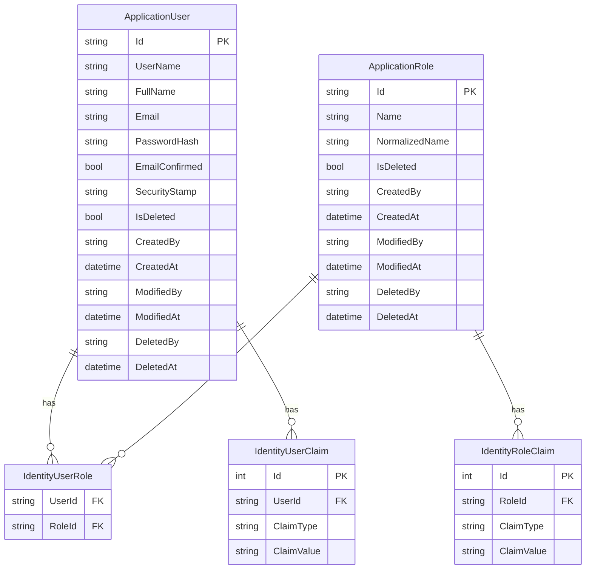

# Esquema de Autenticación y Autorización

Este documento describe el sistema de autenticación y autorización implementado en el AppBase.

## Diagrama de Entidad-Relación



## Descripción del Modelo

### Entidades Principales

#### ApplicationUser
- **Propósito**: Representa un usuario en el sistema
- **Hereda de**: `IdentityUser<int>`
- **Implementa**: 
  - `IAuditableEntity`: Para seguimiento de cambios
  - `ISoftDelete`: Para eliminación lógica
- **Características**:
  - Información básica del usuario (email, username, etc.)
  - Campos de auditoría (creación, modificación)
  - Soporte para soft delete
  - Permisos específicos mediante `UserPermission`

#### ApplicationRole
- **Propósito**: Define roles en el sistema
- **Hereda de**: `IdentityRole<int>`
- **Implementa**: 
  - `IAuditableEntity`
  - `ISoftDelete`
- **Características**:
  - Nombre y descripción del rol
  - Permisos asociados mediante `RolePermission`
  - Auditoría de cambios
  - Soft delete

#### Permission
- **Propósito**: Define permisos disponibles
- **Características**:
  - Nombre único del permiso
  - Nombre para mostrar
  - Descripción
  - Módulo al que pertenece
  - Estado activo/inactivo
  - Soft delete

### Relaciones

#### UserPermission
- **Propósito**: Asigna permisos específicos a usuarios
- **Características**:
  - Puede otorgar o denegar explícitamente
  - Sobrescribe permisos de rol
  - Mantiene auditoría

#### RolePermission
- **Propósito**: Asigna permisos a roles
- **Características**:
  - Define permisos base del rol
  - Herencia automática a usuarios del rol
  - Mantiene auditoría

## Implementación

### Interfaces Base
```csharp
public interface IAuditableEntity
{
    string CreatedBy { get; set; }
    DateTime CreatedAt { get; set; }
    string? ModifiedBy { get; set; }
    DateTime? ModifiedAt { get; set; }
}

public interface ISoftDelete
{
    bool IsDeleted { get; set; }
    string? DeletedBy { get; set; }
    DateTime? DeletedAt { get; set; }
}
```

### Verificación de Permisos
```csharp
// 1. Mediante atributo
[Authorize(Policy = ApplicationClaims.Admin.ManageSettings)]
public class SettingsController : Controller
{
    // ... implementación
}

// 2. Verificación programática
if (await _permissionCheckService.HasWriteAccessAsync(ApplicationClaims.Admin.ManageSettings))
{
    // ... lógica de negocio
}
```

## Características Clave

### Manejo de Permisos
1. **Herencia**:
   - Usuarios heredan permisos de roles
   - Permisos explícitos tienen precedencia
   - Denegaciones explícitas son finales

2. **Optimización**:
   - Caché de permisos por usuario
   - Invalidación automática en cambios
   - Soft delete para historial

### Auditoría
- **Campos Automáticos**:
  - Usuario que realiza cambios
  - Fechas de creación/modificación
  - Estado de eliminación
  - Usuario que elimina

### Tablas en Base de Datos
Todas bajo el schema `identity`:
- `identity_users`
- `identity_roles`
- `identity_permissions`
- `identity_user_permissions`
- `identity_role_permissions`
- `identity_user_roles`

## Referencias
- [ASP.NET Core Identity](https://docs.microsoft.com/aspnet/core/security/authentication/identity)
- [Authorization in ASP.NET Core](https://docs.microsoft.com/aspnet/core/security/authorization/introduction)