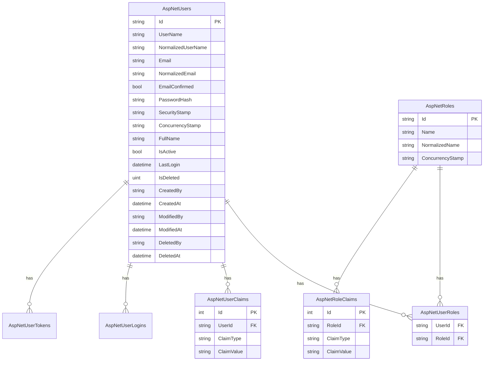

# Esquema de Autenticación y Autorización

Este documento describe el sistema de autenticación y autorización implementado en AppBase: **ASP.NET Core Identity + Claims directos**, sin tablas propias de permisos.

## Diagrama de Entidad-Relación

Todas las tablas son las estándar de ASP.NET Core Identity (`AspNetUsers`, `AspNetRoles`, etc.), sin extensiones de esquema para permisos — los claims viven directamente en `AspNetUserClaims`/`AspNetRoleClaims`.



## Descripción del Modelo

### ApplicationUser (`App.Models/Identity/ApplicationUser.cs`)
- **Hereda de**: `IdentityUser` (clave `string`, no `int`)
- **Implementa**: `IAuditableEntity` (auditoría) e `ISoftDelete` (eliminación lógica)
- Sin tablas de permisos propias — el rol y los claims directos en Identity son la única fuente de autorización

### Roles
- Se usa el `IdentityRole` estándar de ASP.NET Core Identity (`AddIdentity<ApplicationUser, IdentityRole>` en `Program.cs`) — **no hay una clase `ApplicationRole` custom**
- Roles predefinidos en `ApplicationRoles` (`App.Core/Constants/ApplicationRoles.cs`): `SuperAdmin`, `Admin`

### Claims (permisos)
- Definidos como constantes de texto en `ApplicationClaims` (`App.Core/Constants/ApplicationClaims.cs`), agrupados en clases anidadas por módulo (`Admin`, `Shared`, y una por cada dominio que agregues)
- `ApplicationClaims.GetAllClaims()` los enumera por reflexión — usado por `IdentitySeeder` para sembrar y sincronizar claims de rol/usuario
- Un claim es simplemente un par `(ClaimType, ClaimValue)` idénticos, ej. `("Admin.Users.View", "Admin.Users.View")`, asignado directamente a un rol (`AspNetRoleClaims`) o a un usuario (`AspNetUserClaims`, para overrides puntuales)
- No hay herencia de permisos "por módulo" ni tablas `Permission`/`RolePermission`/`UserPermission` — un usuario tiene la unión de los claims de sus roles más sus claims propios, resuelta por el `ClaimsPrincipal` que ASP.NET Core Identity arma al iniciar sesión

## Implementación

### Interfaces Base (`App.Core/Interfaces/`)
```csharp
public interface IAuditableEntity
{
    string CreatedBy { get; set; }
    DateTime CreatedAt { get; set; }
    string? ModifiedBy { get; set; }
    DateTime? ModifiedAt { get; set; }
}

public interface ISoftDelete
{
    uint IsDeleted { get; set; }
    string? DeletedBy { get; set; }
    DateTime? DeletedAt { get; set; }
}
```

### Registro de políticas (`Program.cs`)
Cada claim relevante se registra como una policy de autorización 1:1:

```csharp
services.AddAuthorization(options =>
{
    options.AddPolicy(ApplicationClaims.Admin.ViewUsers,
        policy => policy.RequireClaim(ApplicationClaims.Admin.ViewUsers));

    // Política compuesta: acceso a todo un módulo si tiene cualquier claim que empiece con "Admin."
    options.AddPolicy(ApplicationClaims.Admin.AdminAccess, policy =>
        policy.RequireAssertion(context =>
            context.User.HasClaim(c => c.Type.StartsWith("Admin."))));
});
```

### Verificación de Permisos

```razor
<!-- 1. Declarativa en páginas/componentes -->
@attribute [Authorize(Policy = ApplicationClaims.Admin.ManageSettings)]

<!-- 2. Declarativa parcial de UI -->
<AuthorizeView Policy="@ApplicationClaims.Admin.ViewSettings">
    <Authorized>...</Authorized>
</AuthorizeView>
```

```csharp
// 3. Programática — App.Web/Services/IPermissionCheckService.cs (envuelve IAuthorizationService)
if (await _permissionCheckService.HasWriteAccessAsync(ApplicationClaims.Admin.ManageSettings))
{
    // ...
}
```

## Características Clave

### Sembrado de roles y claims (`IdentitySeeder`)
- Al arrancar, crea los roles de `ApplicationRoles` si no existen
- Asigna a cada rol el subconjunto de claims que le corresponde (`GetClaimsForRole` — `SuperAdmin` recibe todos, `Admin` recibe los que empiezan con `Admin.`/`Shared.`)
- Sincroniza (agrega/quita) claims en cada arranque, no solo la primera vez
- Crea/actualiza el usuario semilla `admin` con todos los claims y rol `SuperAdmin`

### Auditoría
- Campos automáticos (`CreatedBy`/`CreatedAt`/`ModifiedBy`/`ModifiedAt`) puestos por `AuditableEntityInterceptor`
- Cambios registrados además en `aud_change_log` por `AuditLogInterceptor` (ver visor en `/admin/audit-log`)

### Tablas en Base de Datos
Tablas estándar de ASP.NET Core Identity (prefijo `AspNet*`, sin schema separado):
- `AspNetUsers`, `AspNetRoles`, `AspNetUserRoles`
- `AspNetUserClaims`, `AspNetRoleClaims`
- `AspNetUserLogins`, `AspNetUserTokens`

## Referencias
- [ADR-005: Sistema de Autenticación](../adr/0005-sistema-autenticacion.md)
- [ASP.NET Core Identity](https://docs.microsoft.com/aspnet/core/security/authentication/identity)
- [Authorization in ASP.NET Core](https://docs.microsoft.com/aspnet/core/security/authorization/introduction)
