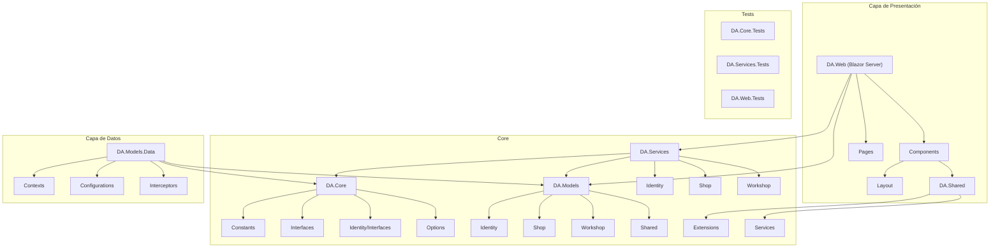

# Estructura del Proyecto

Este documento describe la estructura arquitectónica actualizada del proyecto DA (Detallado Automotriz).

## Diagrama de Arquitectura



## Descripción de Capas

### Presentación (DA.Web)
- **Propósito**: Interfaz de usuario usando Blazor Server con MudBlazor
- **Componentes Principales**:
  - `Components/`: Componentes reutilizables
  - `Pages/`: Páginas principales
  - `Services/`: Servicios específicos de UI

### Core
#### DA.Core
- **Propósito**: Definiciones base e interfaces
- **Componentes**:
  ```plaintext
  DA.Core/
  ├── Constants/
  │   ├── ApplicationRoles.cs
  │   └── ApplicationClaims.cs
  ├── Interfaces/
  │   ├── IAuditableEntity.cs
  │   └── ISoftDelete.cs
  ├── Identity/
  │   └── Interfaces/
  └── Options/
  ```

#### DA.Models
- **Propósito**: Modelos de dominio
- **Componentes**:
  ```plaintext
  DA.Models/
  ├── Identity/
  │   └── ApplicationUser.cs
  ├── Shop/
  ├── Workshop/
  └── Shared/
  ```

#### DA.Services
- **Propósito**: Lógica de negocio
- **Componentes**:
  ```plaintext
  DA.Services/
  ├── Identity/
  │   ├── IdentityService.cs
  │   ├── RoleService.cs
  │   └── IdentitySeeder.cs
  ├── Shop/
  └── Workshop/
  ```

#### DA.Shared
- **Propósito**: Utilidades y servicios compartidos
- **Componentes**:
  ```plaintext
  DA.Shared/
  ├── Extensions/
  └── Services/
      ├── IDateTime.cs
      └── ICurrentUserService.cs
  ```

### Datos (DA.Models.Data)
- **Propósito**: Acceso a datos y configuración de EF Core
- **Componentes**:
  ```plaintext
  DA.Models.Data/
  ├── Contexts/
  │   └── ApplicationDbContext.cs
  ├── Configurations/
  └── Interceptors/
      └── AuditableEntityInterceptor.cs
  ```

### Tests
- **Propósito**: Pruebas unitarias e integración
- **Proyectos**:
  - `DA.Core.Tests/`
  - `DA.Services.Tests/`
  - `DA.Web.Tests/`

## Características Principales

### Identity
- Autenticación basada en username
- Claims predefinidos por módulo
- Roles del sistema
- Seeding automático

### Auditoría
- Campos automáticos:
  - CreatedBy/CreatedAt
  - ModifiedBy/ModifiedAt
  - DeletedBy/DeletedAt
- Soft delete en todas las entidades

### Internacionalización
- Soporte multi-idioma (i18n)
- Recursos localizados
- Español como idioma predeterminado

## Referencias
- [ASP.NET Core Blazor](https://docs.microsoft.com/aspnet/core/blazor)
- [MudBlazor](https://mudblazor.com)
- [Entity Framework Core](https://docs.microsoft.com/ef/core)